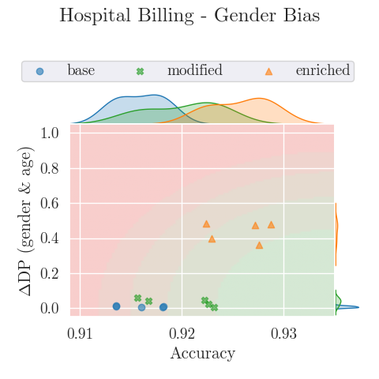
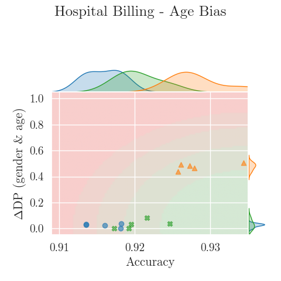

This repository was created for the BPM 2025 submission: 
"A Human-In-The-Loop Approach for Improving Fairness in Predictive Business Process Monitoring"

TABLE OF CONTENTS
-----------------------  
- Installation
- Getting the Event Log Data
- Running complete Process
- Using the `--folder_name` Flag
- Using the `--mode` Flag
- Hyperparameters  
- Supplementary Figures
- Supplementary Tables

INSTALLATION
-----------------------  
This project requires python to be installed:
https://www.python.org/downloads/

Furthermore, this project requires several Python libraries. You can install them using the following command:  

    pip install numpy pandas pm4py scikit-learn tqdm scipy matplotlib seaborn tensorflow  

Additionally, the plots use the CMU Serif Font, which can optionally be installed as well, though not necessary:
https://www.freefonts.io/cmu-serif-free-font/

GETTING THE EVENT LOG DATA
------------------------  
In order to run the experiments for the real-life event logs, the raw data is required, which is not included in the repository.

The Hospital Billing (hb) dataset requires the raw .xes event log to be present in the raw_data subfolder,
under the name "hospital_billing.xes".
The event log can be dowloaded here:
https://data.4tu.nl/articles/dataset/Hospital_Billing_-_Event_Log/12705113

The BPI Challenge 2012 (bpi_2012) dataset requires the raw .xes event log to be present in the raw_data subfolder,
under the name "bpi_2012.xes".
The event log can be dowloaded here:
https://data.4tu.nl/articles/_/12689204/1

RUNNING COMPLETE PROCESS  
------------------------  

To run the full pipeline, use the command:  

    python main.py  

This will:  
- Load and preprocess the data  
- Run all experiments: (cs, hb_-age_-gender, hb_-age_+gender, hb_+age_-gender, hb_+age_+gender, bpi_2012)  
- Run all ablation studies (ablation_bias, ablation_attributes, ablation_decisions)
- Plot the corresponding figures in the `img` subfolder
- Print out the results

Please note that this will take several hours.

USING THE `--folder_name` FLAG  
------------------------------  

The `--folder_name` flag specifies which dataset to use. If omitted, the script processes all available datasets.  
For example, specifying `--folder_name cs` ensures only the `cs` dataset is used instead of running all datasets.  

USING THE `--mode` FLAG  
-----------------------

Instead of running the full process, you can execute specific parts of the pipeline using the `--mode` flag.  
If no mode is specified, the script will automatically run the complete process.
The available modes are:  

- **Loading Mode (`-l`)**  
  Loads and preprocesses dataset(s), converting event logs into structured data for analysis.  
  Example:  

      python main.py --mode l --folder_name bpi_2012

    This loads and processes the `bpi_2012` dataset.

- **Evaluation Mode (`-e`)**  
  Runs the evaluation process for the specified experiments, performing k-fold cross-validation and computing results.  
  Requires the data to be preprocessed via loading (`-l`)
  Example:  

      python main.py --mode e --folder_name cs

  This runs evaluation on the `cs` dataset.

- **Ablation Mode (`-a`)**  
  Runs ablation studies, modifying or removing key factors in the dataset to analyze their impact.  
  Example:  

      python main.py --mode a --folder_name ablation_bias  

  This runs the ablation study related to bias strength.  

- **Results Mode (`-r`)**  
  Displays the results, assuming that they are already present.  
  Example:  

      python main.py --mode r --folder_name ablation_attributes 

  This displays the results of the ablation study related to the number of attributes.  

- **Results Mode (`-p`)**  
  Creates the plots used to visualize the results in the `img` subfolder.
  !Requires the results from all experiments and ablations, not compatible with `--folder_name`!
  Example:  

      python main.py --mode p

HYPERPARAMETERS  
---------------  

The following hyperparameters are used in model definitions and training processes.

**Neural Network Architecture:**  
- **Layers:** 5 fully connected layers (512, 256, 128, 64, output_dim)  
- **Activations:** ReLU for hidden layers, Softmax for output layer  
- **Optimizer:** Adam (default learning rate: **0.001**)  
- **Loss Function:** Categorical Crossentropy  
- **Metrics:** Accuracy  
- **Other Parameters:** Default values from `tensorflow.keras.Sequential` and `tensorflow.keras.optimizers.Adam`  

**Training the Neural Network:**  
- **Epochs:** 10 (default)  
- **Batch Size:** 32 (default)  
- **Learning Rate:** 0.001 (default)  

**Fine-Tuning the Neural Network:**  
- **Epochs:** 5  
- **Batch Size:** 32 (default)  
- **Learning Rate:** 0.001 (default)  

**Training the Decision Tree:**  
- **ccp_alpha:** 0.001 (pruning parameter)  
- **Other Parameters:** Default values from `sklearn.tree.DecisionTreeClassifier`

SUPPLEMENTARY FIGURES
---------------------
Supplementary figures can be found in the `img` subfolder.
Although most informative figures are already present in the paper,
the `img` subfolder also contains the figures for the `Hospital Billing` event log variations,
in which only one attribute was biased.

SUPPLEMENTARY TABLES
---------------------
Supplementary tables can be found in the `tables.pdf`.
These include:
- Combined evaluation results
- `Hospital Billing` evaluation results
- Tree Metrics
- Ablation: `Bias Strength` evaluation results
- Ablation: `Number of Attributes` evaluation results
- Ablation: `Bias Strength` evaluation results
- Accuracy comparison of modified neural network and modified decision tree